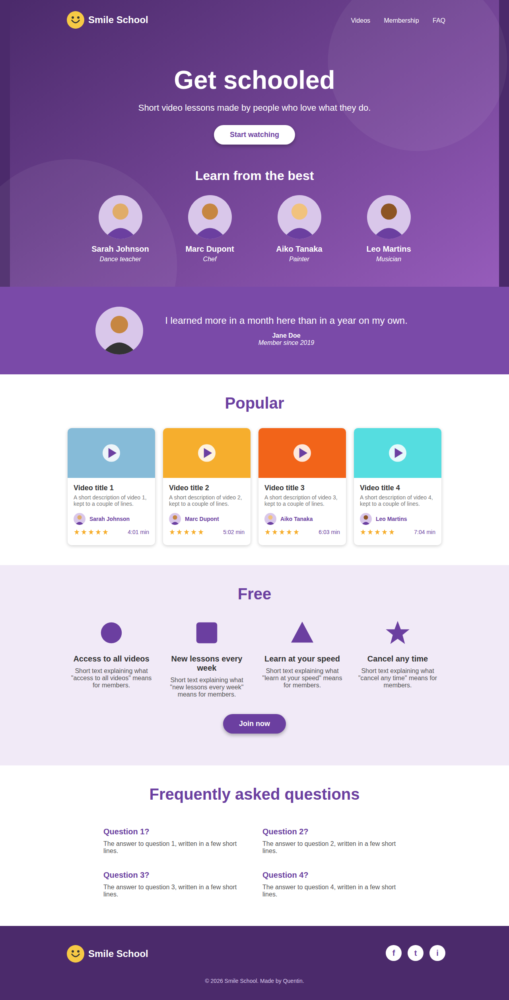

# CSS Advanced - Smile School

This project adds the style to the Smile School page built in the HTML advanced project. The HTML structure stays the same. All the look of the page (colors, fonts, spacing, layout) comes from one file, `styles.css`.

## What is styled

1. **Header and banner**: a centered header with the logo on the left and the three links on the right, a big "Get schooled" title, a rounded button with a shadow, and four round profile pictures. The purple background is an image.
2. **Quote**: a purple block with the member photo on the left and the quote on the right.
3. **Videos**: "Popular" section with four cards. Each card has rounded corners, a player icon on the thumbnail, the author, five stars and the duration.
4. **Membership**: "Free" section with four items in a row and a purple button.
5. **FAQ**: four questions shown as a two by two grid.
6. **Footer**: logo on the left, three social icons on the right and the copyright centered below.

## How the layout works

- Flexbox is used for every row (header, profiles, video cards, membership items, FAQ rows, footer).
- Content blocks have a `max-width` and `margin: 0 auto`, so they stay centered and do not take the full width of big screens.
- Each section has its own id (`banner`, `quote`, `videos`, `membership`, `faq`), so the CSS selectors stay short.
- A small media query under 700px stacks the rows into columns for phones.

## Files

- `index.html`: the page.
- `styles.css`: all the styling.
- `images/`: logo, background, avatars, video thumbnails, icons and social images.

## Notes

- The colors, sizes and images are my own approximation of the Figma design. The original Figma values can be swapped in `styles.css` without touching the HTML.
- To check the page, open `index.html` in a browser.
